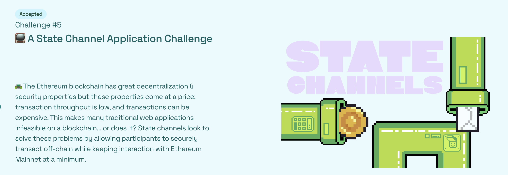
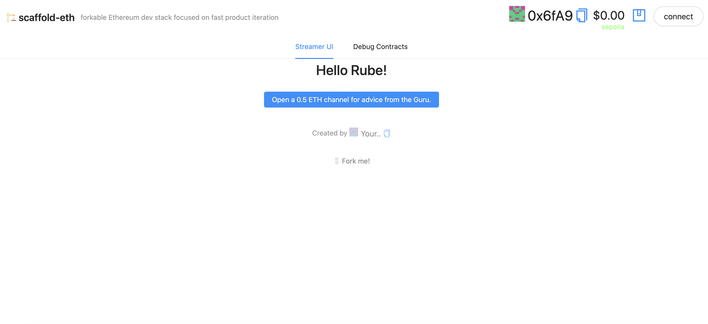

# 🏗 scaffold-eth | 🏰 BuidlGuidl

> 🐌 The Ethereum blockchain has great decentralization & security properties. These properties come at a price: transaction throughput is low, and transactions can be expensive (search term: blockchain trilemma). This makes many traditional web applications infeasible on a blockchain... or does it?

> 🍰 A number of approaches to scaling have been developed, collectively referred to as layer-2s (L2s). Among them is the concept of payment channels, state channels, and state channel networks. This tutorial walks through the creation of a simple state channel application, where users seeking a service **lock** collateral on-chain with a single transaction, **interact** with their service provider entirely off-chain, and **finalize** the interaction with a second on-chain transaction.

> 🧑‍🤝‍🧑 State channels really excel as a scaling solution in cases where a fixed set of participants want to exchange value-for-service at high frequency. The canonical example is in file sharing or media streaming: the server exchanges chunks of a file in exchange for micropayments.

> 🧙 In our case, the service provider is a `Guru` who provides off-the-cuff wisdom to each client `Rube` through a one-way chat box. Each character of text that is delivered is expected to be compensated with a payment of `0.001 ETH`.

> 📖 Read more about state channels in the [Ethereum Docs.](https://ethereum.org/en/developers/docs/scaling/state-channels/)

> ❗ [OpenZepplin's ECDSA Library](https://docs.openzeppelin.com/contracts/2.x/api/cryptography#ECDSA) provides an easy way to verify signed messages, but for this challenge we'll write the code ourselves.

We will:

- 🛣️ Build a `Streamer.sol` contract that collects **ETH** from numerous client addresses using a payable `fundChannel()` function and keeps track of `balances`.
- 💵 Exchange paid services off-chain between the `Streamer.sol` contract owner (the **Guru**) and **rube** clients with funded channels. The **Guru** provides the service in exchange for signed vouchers which can later be redeemed on-chain.
- ⏱ Create a Challenge mechanism with a timeout, so that **rubes** are protected from a **Guru** who goes offline while funds are locked on-chain (either by accident, or as a theft attempt).
- ⁉ Consider some security / usability holes in the current design.

Stream Contract:
CODE: https://sepolia.etherscan.io/address/0x233b196ffFce60740a702a0eA0E2651F975A630d#code

DEMO: http://wholesale-boot.surge.sh/

📺  State Channels deploy on Ethereum Sepolia testnet 📺
